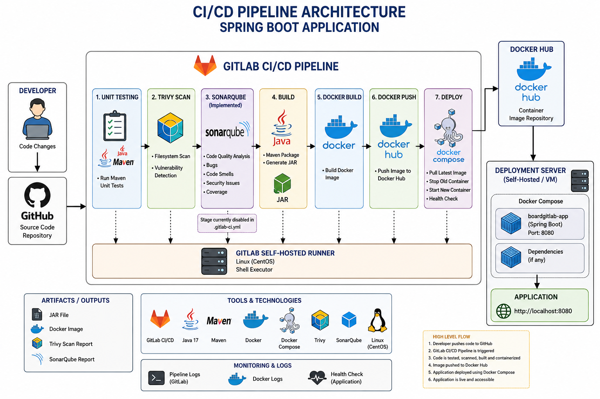

# Enterprise CI/CD Pipeline for Spring Boot using GitLab CI/CD

> End-to-End CI/CD Pipeline for a Spring Boot application using **GitLab CI/CD**, **Maven**, **Docker**, **Trivy**, **SonarQube**, and **Docker Compose** with a **Self-Hosted GitLab Runner**.

---

# Project Overview

This project demonstrates the implementation of a complete Enterprise CI/CD pipeline for a Spring Boot application.

The pipeline automates the entire software delivery lifecycle starting from source code integration, automated testing, security scanning, code quality analysis, application packaging, Docker image creation, image publishing to Docker Hub, and deployment using Docker Compose.

The primary objective of this project is to simulate a real-world DevOps workflow followed in modern software development teams.

---

# Architecture

> **CI/CD Pipeline Architecture**

<p align="center">

</p>

---

# CI/CD Workflow

```text
Developer
    │
    ▼
Push Code to GitHub
    │
    ▼
GitLab Repository
    │
    ▼
GitLab CI/CD Pipeline
    │
    ├───────────────► Unit Testing
    │
    ├───────────────► Trivy Filesystem Scan
    │
    ├───────────────► SonarQube Code Analysis
    │
    ├───────────────► Maven Build
    │
    ├───────────────► Docker Image Build
    │
    ├───────────────► Push Image to Docker Hub
    │
    └───────────────► Docker Compose Deployment
                              │
                              ▼
                    Spring Boot Application
```

---

# Technologies Used

| Category                | Technologies              |
| ----------------------- | ------------------------- |
| Version Control         | Git, GitHub               |
| CI/CD                   | GitLab CI/CD              |
| Build Tool              | Maven                     |
| Programming Language    | Java 17                   |
| Framework               | Spring Boot               |
| Security Scan           | Trivy                     |
| Code Quality            | SonarQube                 |
| Containerization        | Docker                    |
| Container Orchestration | Docker Compose            |
| Runner                  | GitLab Self Hosted Runner |
| Operating System        | CentOS Linux              |

---

#  Pipeline Stages

## Unit Testing

Executes Maven Unit Tests before building the application.

```bash
mvn test
```

---

## Trivy Security Scan

Scans the project filesystem and application dependencies for known vulnerabilities.

```bash
trivy fs .
```

---

## SonarQube Code Analysis

Performs Static Code Analysis to identify

* Bugs
* Vulnerabilities
* Code Smells
* Maintainability Issues
* Technical Debt
* Code Coverage

## Maven Build

Packages the Spring Boot application into an executable JAR file.

```bash
mvn package
```

Output

```text
target/database_service_project-0.0.5-SNAPSHOT.jar
```

---

## Docker Build

Creates a Docker Image from the packaged Spring Boot application.

```bash
docker build -t prathamesh45/boardgitlab:latest .
```

---

## Docker Hub Push

Pushes the Docker Image to Docker Hub.

```bash
docker push prathamesh45/boardgitlab:latest
```

---

## Deployment

Deploys the latest Docker Image using Docker Compose.

Deployment Process

* Pull latest Docker image
* Stop existing containers
* Remove old containers
* Start new containers
* Verify deployment
* Perform health check

---

# Repository Structure

```text
SPRINGBOOT-GITLAB-CICD
│
├── src/
│
├── .gitlab-ci.yml
├── Dockerfile
├── docker-compose.yml
├── deployment-service.yaml
├── Jenkinsfile
├── pom.xml
├── sonar-project.properties
├── README.md
│
├── architecture/
│      └── architecture.png
│
└── screenshots/
```

---

# Pipeline Features

* Automated Unit Testing
* Automated Security Scanning
* Static Code Analysis
* Automated Maven Build
* Docker Image Creation
* Docker Hub Integration
* Automated Deployment
* Health Check Validation
* Self Hosted GitLab Runner
* Docker Compose Based Deployment

---

# Screenshots

## GitLab Pipeline

> Add pipeline screenshot here

```
screenshots/gitlab-pipeline.png
```

---

## Unit Test

> Add Unit Test screenshot here

```
screenshots/unit_Test.png
```

---

## Trivy Scan

> Add Trivy Scan screenshot here

```
screenshots/trivy-report.png
```

---

## SonarQube Dashboard

> Add SonarQube screenshot here

```
screenshots/sonarqube-dashboard.png
```

---

## Docker Hub Repository

> Add Docker Hub screenshot here

```
screenshots/dockerhub.png
```

---

## Running Application

> Add Application screenshot here

```
screenshots/application.png
```

---

# Project Highlights

✔ End-to-End Enterprise CI/CD Pipeline

✔ GitLab Self Hosted Runner Configuration

✔ Automated Build & Deployment

✔ Docker Based Application Delivery

✔ Security Scanning using Trivy

✔ Static Code Analysis using SonarQube

✔ Containerized Spring Boot Application

✔ Docker Compose Deployment

---

# Future Enhancements

* Nexus Repository Integration
* Kubernetes Deployment
* Helm Charts
* AWS EC2 Deployment
* Amazon EKS Deployment
* GitLab Environments
* Blue-Green Deployment
* Rolling Updates
* Slack Notifications
* Email Notifications
* Monitoring using Prometheus & Grafana

---

# Author

**Prathamesh Mane**

DevOps Engineer | Cloud Engineer | Linux | Docker | Kubernetes | GitLab CI/CD

---


